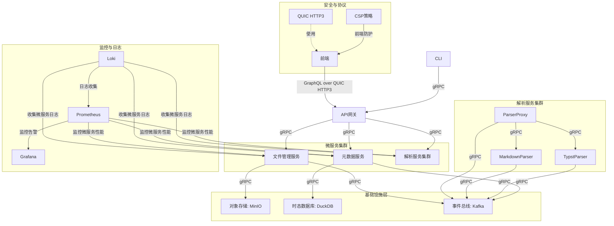
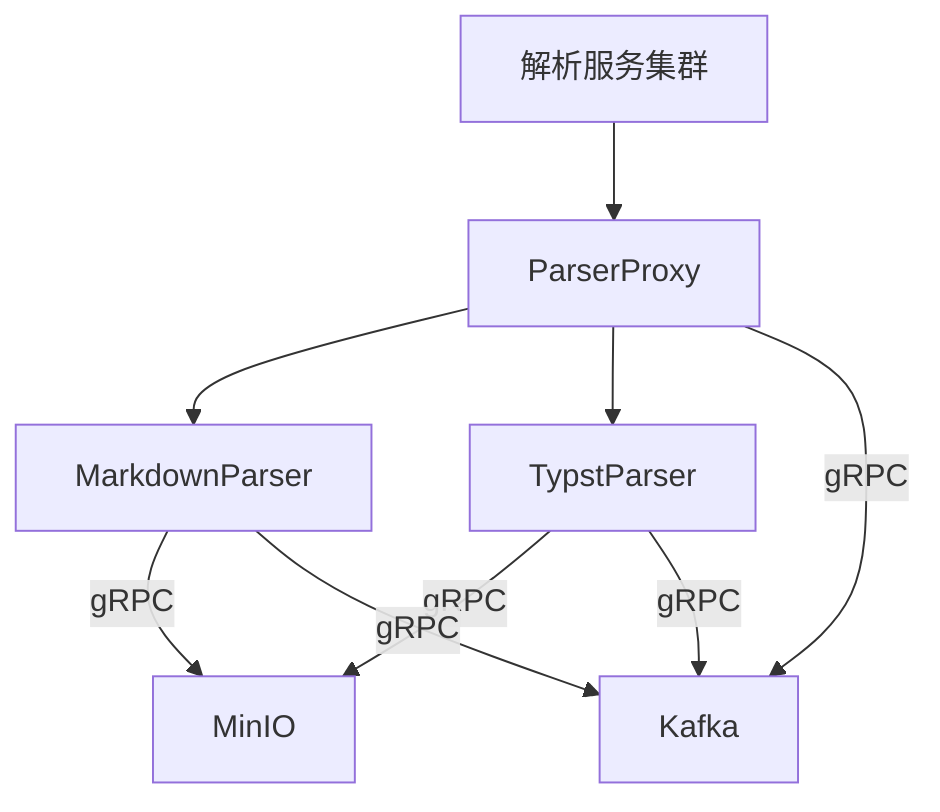
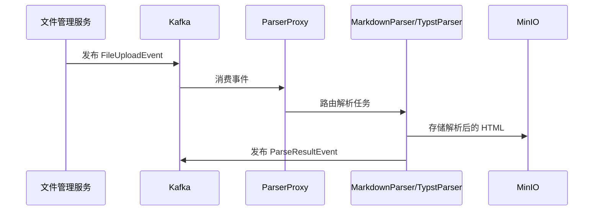
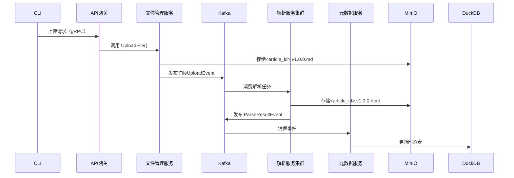
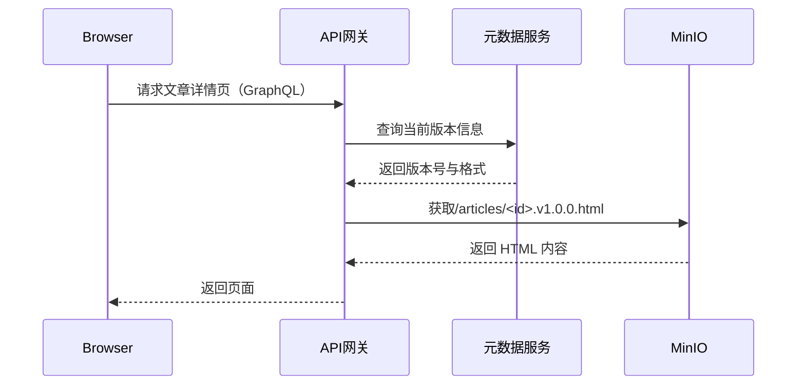
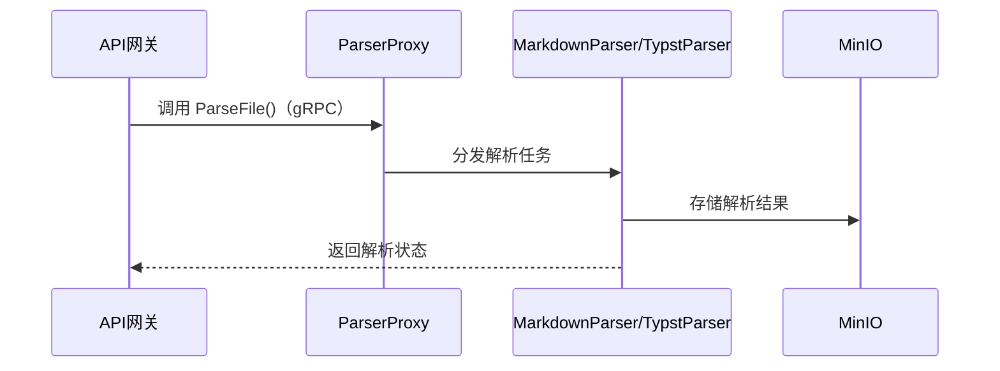

# 支持 Markdown/Typst 双格式的静态博客平台需求规格说明书

---

## 1. 引言

### 1.1 目的
本文档旨在全面定义支持 **Markdown/Typst 双格式** 的静态博客平台的需求，涵盖 **前端、API 网关、元数据服务、文件管理服务、解析服务集群、对象存储、时态数据库、事件总线** 八大核心组件的职责与功能。通过明确的技术实现依据，为开发团队提供统一的开发框架与协作基础。

### 1.2 范围
- **版本管理**：CLI 自动递增版本号（如 `1.0.0 → 1.0.1`），支持 Markdown/Typst 格式切换。
- **多格式兼容**：前端动态选择解析器（Markdown/Typst）。
- **高效存储**：基于 MinIO 的对象存储与 DuckDB 的时态元数据管理。
- **安全分发**：HTTPS/QUIC 加密传输、CSP 策略防护。
- **最终一致性**：通过 Saga 模式保障存储与元数据一致性。
- **低延迟交互**：前端与 API 网关使用 QUIC 协议的 GraphQL 通信，其余交互使用 gRPC。

---

## 2. 系统架构

### 2.1 架构设计


### 2.2 分层架构

系统采用 **五层分层架构**，确保模块职责清晰、交互高效：

1. **前端层**：Blazor WASM，负责用户交互与动态渲染。
2. **API 网关层**：Kratos 框架，提供认证、限流、熔断等能力。
3. **微服务层**：元数据服务、文件管理服务、解析服务集群。
4. **基础设施层**：MinIO、DuckDB、Kafka。
5. **监控与日志层**：Loki + Prometheus + Grafana。

---

## 3. 核心组件职责与功能

### 3.1 前端（Blazor WASM）

#### 职责定位

- **纯客户端渲染**：基于 WebAssembly 实现无服务器依赖的页面交互。
- **多格式适配**：根据文章版本记录动态选择解析器（Markdown/Typst）。
- **安全防护**：HTTPS/QUIC 加密通信 + 内容安全策略（CSP）防止 XSS 攻击。
- **GraphQL 客户端**：通过 HttpClient 或专用 GraphQL 客户端库发送查询，使用 QUIC 协议与 API 网关通信。

#### 核心功能模块

| 模块 | 功能说明 |
|------|----------|
| 文章列表页 | 分页加载、标签筛选、实时搜索（防抖处理）。 |
| 文章详情页 | 渲染 HTML（代码高亮、数学公式）、图片懒加载、导航守卫。 |
| 缓存管理 | IndexedDB 本地存储最近 5 篇文章，预加载资源提升加载速度。 |
| GraphQL 交互 | 发送 `query { articles }` 等请求，接收结构化数据响应。 |

---

### 3.2 API 网关（Kratos 框架）

#### 职责定位

- **统一入口**：路由请求到后端微服务，实现认证、限流、熔断。
- **协议转换**：将 HTTP 请求转换为 gRPC 调用，保留 GraphQL 接口。
- **QUIC 协议适配**：支持 HTTP/3（基于 QUIC），实现低延迟通信。

#### 核心功能模块

| 模块 | 功能说明 |
|------|----------|
| 认证服务 | JWT 令牌签发/验证，权限控制（管理员/普通用户）。 |
| GraphQL 路由 | 将 GraphQL 查询路由到对应微服务（如 `/graphql/articles → 元数据服务`）。 |
| 熔断限流 | 集成 Hystrix，防止雪崩效应。 |
| QUIC 支持 | 使用 Caddy 或 Go 原生 QUIC 库（如 quic-go）实现 HTTP/3 协议。 |

#### 技术实现建议

- **GraphQL 服务**：在 Kratos 中集成 GraphQL Go 或 Gorilla GraphQL。
- **gRPC 支持**：在 Kratos 的 `config.yaml` 中启用 gRPC 服务：

  ```yaml
  grpc:
    addr: :50051
    enable: true
  ```

- **QUIC 配置**：在 Kratos 的 `config.yaml` 中启用 HTTP/3（基于 QUIC）：

  ```yaml
  http:
    addr: :443
    tls:
      cert_file: /path/to/cert.pem
      key_file: /path/to/key.pem
      min_version: TLS13
      quic: true
  ```

---

### 3.3 元数据服务（Go + GORM）

#### 职责定位

- **时态数据管理**：维护文章当前状态与历史版本。
- **权限控制**：基于 RBAC 的细粒度访问控制。
- **GraphQL 接口**：提供 GraphQL 查询接口（如 `article(id: "123") { title, content }`）。

#### 核心功能模块

| 模块 | 功能说明 |
|------|----------|
| GraphQL 查询 | 实现 Query 类型，暴露文章元数据。 |
| 版本管理 | 记录每个版本的格式、哈希值与创建时间。 |
| 权限服务 | RBAC 权限验证，支持文章级权限控制。 |

#### 示例 GraphQL Schema

```graphql
type Article {
  id: ID!
  title: String!
  content: String!
  version: String!
  format: String! # markdown/typst
}

type Query {
  article(id: ID!): Article
  articles(tag: String, limit: Int): [Article]
}
```

---

### 3.4 文件管理服务（Go + gRPC）

#### 职责定位

- **文件存储管理**：与 MinIO 集成，管理文章源文件与解析后的 HTML。
- **事件触发**：通过 Kafka 发布文件上传事件。
- **gRPC 接口**：提供 gRPC 服务接口供 API 网关调用。

#### 核心功能模块

| 模块 | 功能说明 |
|------|----------|
| 文件上传 | 接收文件并存储到 MinIO，返回存储路径。 |
| 文件下载 | 根据路径从 MinIO 获取文件内容。 |
| 事件发布 | 通过 Kafka 发布文件上传事件，触发解析服务。 |

---

### 3.5 解析服务集群（Go/Rust + gRPC）

#### 3.5.1 架构设计



#### 3.5.2 核心组件

##### 1. ParserProxy

- **职责定位**：
  - 动态路由：根据文章元数据中的 `format` 字段（markdown/typst），将解析请求路由到对应解析器。
  - 负载均衡：支持多实例部署，通过一致性哈希算法分配任务，避免单点故障。
  - 协议适配：将 API 网关的 gRPC 请求转换为 MarkdownParser/TypstParser 的内部通信协议（如 Thrift/Protobuf）。

- **核心功能模块**：

  | 模块 | 功能说明 |
  |------|----------|
  | 路由引擎 | 基于 `format` 字段动态选择 MarkdownParser 或 TypstParser。 |
  | 健康检查 | 定期检测后端解析器的可用性，自动剔除异常节点。 |
  | 任务队列 | 队列化管理解析任务，支持优先级调度（如紧急任务插队）。 |

- **技术实现建议**：
  - 使用 Go 实现，结合 gRPC 和 Consul 实现服务发现与负载均衡。
  - 示例代码片段：

    ```go
    func routeParser(format string) (ParserClient, error) {
        switch format {
        case "markdown":
            return NewMarkdownParserClient(), nil
        case "typst":
            return NewTypstParserClient(), nil
        default:
            return nil, errors.New("unsupported format")
        }
    }
    ```

##### 2. MarkdownParser

- **职责定位**：
  - 格式转换：将 Markdown 源文件解析为 HTML，并支持数学公式（MathJax）、代码高亮（Highlight.js）等扩展。
  - 安全渲染：过滤潜在危险内容（如 XSS 攻击），确保输出 HTML 符合 CSP 策略。
  - 版本兼容：支持 Markdown 4.0+ 语法，适配 CommonMark/GFM 规范。

- **核心功能模块**：

  | 模块 | 功能说明 |
  |------|----------|
  | 解析引擎 | 使用 Blackfriday 或 CommonMark 实现 Markdown 解析。 |
  | 安全过滤 | 集成 bluemonday 过滤 HTML 危险标签。 |
  | 格式扩展 | 支持自定义扩展（如 Mermaid 图表、Emoji 渲染）。 |

- **技术实现建议**：
  - 使用 Go 实现，依赖 GitHub 的 Markdown 解析库。
  - 示例代码片段：

    ```go
    func parseMarkdown(content []byte) ([]byte, error) {
        htmlFlags := blackfriday.HTML_USE_XHTML | blackfriday.HTML_NO_FOOTNOTE_REF_LINKS
        renderer := blackfriday.HtmlRenderer(htmlFlags, "", "")
        parser := blackfriday.New(blackfriday.WithRenderer(renderer))
        return parser.Run(content), nil
    }
    ```

##### 3. TypstParser

- **职责定位**：
  - Typst 语法支持：解析 Typst 源文件（.typ），生成高质量的 HTML/CSS 输出。
  - 排版优化：支持复杂排版（如多列布局、数学公式、图表嵌入）。
  - 性能调优：针对 Typst 的编译特性（静态类型检查）进行并行解析优化。

- **核心功能模块**：

  | 模块 | 功能说明 |
  |------|----------|
  | Typst 编译器 | 集成 Typst 官方编译器，支持 .typ 文件解析。 |
  | HTML 转换 | 将 Typst 的 AST（抽象语法树）转换为语义化 HTML。 |
  | 样式注入 | 自动注入 CSS 样式，适配移动端和桌面端显示。 |

- **技术实现建议**：
  - 使用 Rust 实现，依赖 Typst 的原生库。
  - 示例代码片段：

    ```rust
    use typst::eval::Engine;
    use typst::foundations::Value;

    pub fn parse_typst(content: &str) -> Result<String, String> {
        let engine = Engine::default();
        let value = engine.compile(content.as_bytes()).map_err(|e| e.to_string())?;
        Ok(value.to_string())
    }
    ```

#### 3.5.3 交互流程

##### 1. 解析任务触发流程



##### 2. 解析服务异常处理

- **重试机制**：解析失败时自动重试（最多 3 次），若仍失败则记录日志并通知管理员。
- **死信队列**：无法解析的文件进入 Kafka 的死信队列，供人工排查。

#### 3.5.4 技术选型与依赖

| 组件 | 技术选型 | 说明 |
|------|----------|------|
| ParserProxy | Go + gRPC + Consul | 实现动态路由与负载均衡。 |
| MarkdownParser | Go + Blackfriday + Bluemonday | 支持 Markdown 解析与安全渲染。 |
| TypstParser | Rust + Typst | 高性能 Typst 解析与排版。 |
| 通信协议 | gRPC | 服务间低延迟通信。 |
| 日志记录 | Loki + Promtail | 集中式日志收集与分析。 |
| 监控告警 | Prometheus + Grafana | 监控解析服务的 QPS、错误率等指标。 |

#### 3.5.5 扩展性设计

- **多格式支持**：未来可通过扩展 ParserProxy 的路由规则，支持 LaTeX、Asciidoc 等格式。
- **插件化架构**：将 MarkdownParser/TypstParser 设计为独立插件，通过配置文件动态加载。
- **分布式部署**：通过 Kubernetes 实现解析服务的水平扩展，应对高并发场景。

---

## 4. 系统交互流程

### 4.1 内容发布流程（Saga 模式）



### 4.2 内容访问流程（多格式适配）



### 4.3 解析服务调用流程



---

## 5. 技术选型与依赖

| 组件 | 技术选型 | 说明 |
|------|----------|------|
| 前端 | Blazor WASM | 基于 .NET 的客户端框架，支持 WebAssembly 渲染。 |
| API 网关 | Kratos | 提供统一入口，支持 gRPC 和 QUIC 协议。 |
| 元数据服务 | Go + GORM + gRPC | 时态数据库管理，支持 gRPC 接口。 |
| 文件管理服务 | Go + gRPC | 与 MinIO 集成，管理文件存储。 |
| 解析服务集群 | Go/Rust + gRPC | 支持 Markdown/Typst 格式解析。 |
| 对象存储 | MinIO | 高性能对象存储，兼容 S3 API。 |
| 时态数据库 | DuckDB | 轻量级时态数据库，支持版本历史管理。 |
| 事件总线 | Kafka | 分布式事件驱动架构，保障最终一致性。 |
| Markdown 解析 | Blackfriday | GitHub 官方 Markdown 解析库。 |
| Typst 编译器 | Typst Rust SDK | 原生支持 Typst 语法与排版。 |
| 安全过滤 | Bluemonday | GitHub 官方 HTML 安全过滤库。 |
| 日志收集 | Loki | 轻量级日志聚合系统，兼容 Kubernetes。 |
| 监控告警 | Prometheus + Grafana | 实时监控解析服务性能指标。 |

---

## 6. 附录

### 6.1 术语表

| 术语 | 定义 |
|------|------|
| **Blazor WebAssembly (WASM)** | 基于 WebAssembly 技术的 .NET 前端框架，支持在浏览器中运行 C# 代码，提供高性能的客户端渲染能力。 |
| **Kratos 框架** | 微服务 API 网关框架，提供服务发现、路由、认证、限流等功能，作为系统统一入口。 |
| **DuckDB** | 高性能嵌入式分析型数据库管理系统，采用列式存储和向量化查询引擎，专为 OLAP 场景优化。 |
| **MinIO** | 分布式对象存储服务，完全兼容 Amazon S3 API，支持高并发、低延迟的数据存储与访问。 |
| **Saga 模式** | 分布式事务协调模式，将长事务分解为多个本地短事务，通过事件驱动和补偿机制保证事务最终一致性。 |
| **QUIC 协议** | 基于 UDP 的传输层协议（RFC 9000），支持加密、多流复用，是 HTTP/3 的基础传输层。 |
| **CSP 策略** | 内容安全策略（Content Security Policy），通过 HTTP 头定义资源加载规则，防止 XSS 等安全攻击。 |

---

## 7. 参考资料

- [GraphQL.Client](https://github.com/dotnet/GraphQL.Client) - .NET 的 GraphQL 客户端库
- [quic-go](https://github.com/lucas-clemente/quic-go) - Go 实现的 QUIC 协议
- [gqlgen](https://github.com/99designs/gqlgen) - Go 的 GraphQL 服务生成器
- [Typst 官方文档](https://typst.app/docs/) - Typst 文档格式与编译器
- [MinIO 官方文档](https://docs.min.io/) - 对象存储解决方案
- [DuckDB 官方文档](https://duckdb.org/docs/) - 时态数据库与查询引擎
